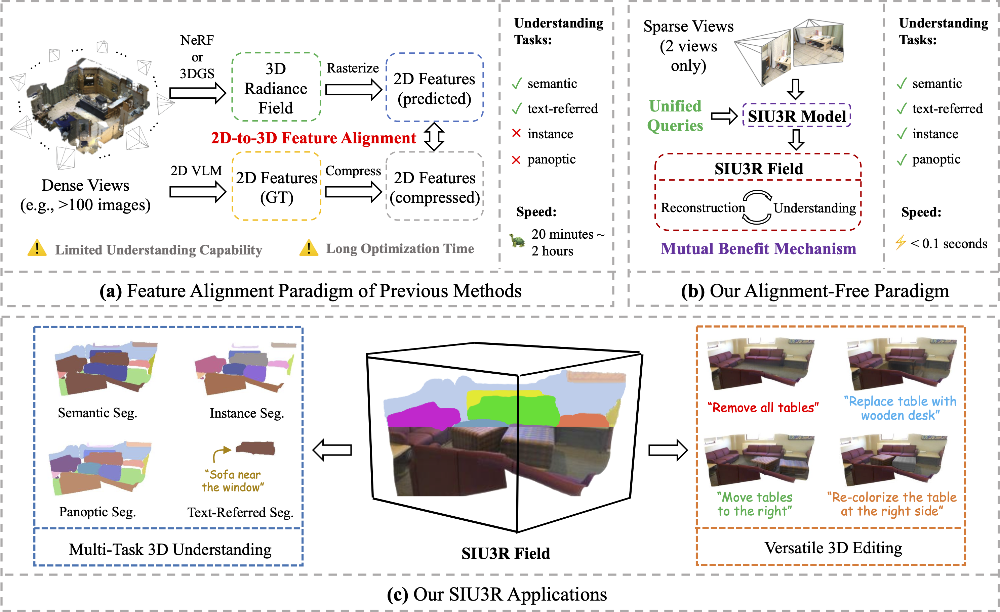

<h2 align="center"> <a href="https://arxiv.org/abs/2507.02705"> SIU3R: Simultaneous Scene Understanding and 3D Reconstruction Beyond Feature Alignment

<h5 align="center">

[](https://arxiv.org/abs/2507.02705)
[](https://insomniaaac.github.io/siu3r/)

</h5>
<div align="center">
This repository is the official implementation of the SIU3R.

SIU3R is a feed-forward method that can achieve simultaneous 3D scene understanding and reconstruction given unposed images. In particular, SIU3R does not require feature alignment with 2D VLMs (e.g., CLIP, LSeg) to enable understanding, which unleashes its potential as a unified model to achieve multiple 3D understanding tasks (i.e., semantic, instance, panoptic and text-referred segmentation). Moreover, tailored designs for mutual benefits can further boost SIU3R's performance by encouraging bi-directional promotion between reconstruction and understanding.
</div>
<br>




📢 The code and pretrained model will be released in the near future.

## 🚧 TODO
- [ ] Release inference code and pretrained models
- [ ] Release gradio demo 
- [ ] Release training code

## 📖 Citation

If you find our work useful, please consider citing our paper:

```bibtex
@misc{xu2025siu3r,
    title={SIU3R: Simultaneous Scene Understanding and 3D Reconstruction Beyond Feature Alignment},
    author={Qi Xu and Dongxu Wei and Lingzhe Zhao and Wenpu Li and Zhangchi Huang and Shunping Ji and Peidong Liu},
    year={2025},
    eprint={2507.02705},
    archivePrefix={arXiv},
    primaryClass={cs.CV}
}
```